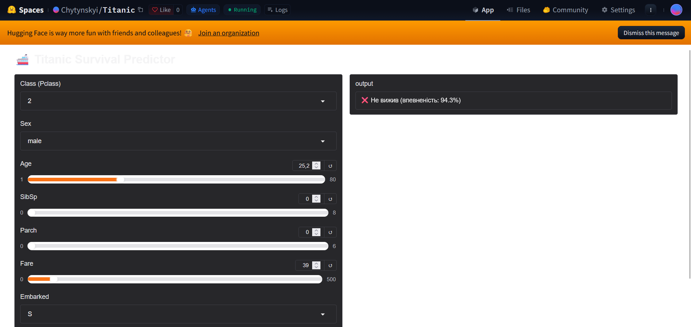

<p align="center">
  
  
</p>

# 🚢 Titanic Survival Predictor

A machine learning project that predicts Titanic passenger survival using several classification algorithms with automated best-model selection, plus an interactive Gradio app for live predictions.

## 📁 Project Structure

```
Titanic/
├── Data/
│   └── Raw/
│       ├── train.csv
│       └── test.csv
├── src/
│   ├── data_preprocessing.py
│   ├── feature_engineering.py
│   └── model.py
├── main.py              # model training + saving artifacts
├── app.py                # Gradio app for survival prediction
├── artifacts.pkl          # saved model + preprocessor + kmeans (created by main.py)
├── requirements.txt
└── README.md
```

## ⚙️ How It Works

**1. Data Preprocessing** (`src/data_preprocessing.py`)
- Fills missing numerical values using **median imputation**
- Fills missing categorical values using the **most frequent** strategy
- Encodes categorical variables with **OrdinalEncoder**
- `fit` is performed only on train data — no data leakage

**2. Feature Engineering** (`src/feature_engineering.py`)
- `Family` — family size (`Parch + SibSp + 1`)
- `IsAlone`, `HasCabin` — binary flags
- Interaction features: `Pclass_Sex`, `Age_Class`, `Fare_Family`, `Family_Pclass`, `Age_Sex`, `Fare_Sex`, `Fare_Class`, `Age_Fare`
- Passenger clustering using **KMeans** (5 clusters) — fitted only on train data
- Drops irrelevant columns (`PassengerId`, `Name`, `Ticket`, `Cabin`)

**3. Model Training & Selection** (`src/model.py`)
- Evaluates 7 classification models using **StratifiedKFold cross-validation (cv=5)**:
  - Random Forest
  - Gradient Boosting
  - Logistic Regression
  - K-Nearest Neighbors
  - Support Vector Machine
  - Decision Tree
  - Naive Bayes
- Automatically selects the **best model** and fits it on the full training data

**4. Saving Artifacts** (`main.py`)
- Saves the model, preprocessor, and KMeans object to `artifacts.pkl` — this is the file `app.py` later loads

**5. Interactive Prediction** (`app.py`)
- A **Gradio** web interface with fields for: ticket class, sex, age, number of relatives aboard (SibSp/Parch), fare, and port of embarkation
- Loads `artifacts.pkl` and applies the same preprocessing and feature engineering pipeline used during training
- Returns "survived" or "did not survive" along with the model's confidence (`predict_proba`)

## 🚀 Getting Started

### Install Dependencies

```bash
pip install -r requirements.txt
```

### Train the Model

```bash
python main.py
```

The script will:
1. Load and preprocess `Data/Raw/train.csv` and `Data/Raw/test.csv`
2. Engineer features
3. Train and evaluate all 7 models via cross-validation
4. Print the best model along with its accuracy
5. Save the model, preprocessor, and kmeans object to `artifacts.pkl`

### Run the Interactive App

```bash
python app.py
```

This opens a local Gradio interface where you can set passenger parameters (class, sex, age, number of relatives, fare, port of embarkation) and instantly get a survival prediction with the model's confidence level.

> The project is also ready for deployment to **Hugging Face Spaces**: the YAML header in the README is already configured for the Gradio SDK.

## 📊 Results

| Metric | Score |
|--------|-------|
| Local CV Accuracy | ~83% |
| Kaggle Public Leaderboard | ~76% |

> The gap between local CV (~83%) and Kaggle (~76%) is typical for this dataset due to its small size (891 rows) — the model generalizes slightly less well to unseen data.

## 💡 Possible Improvements

- Extract `Title` from passenger name (`Mr`, `Mrs`, `Miss`, `Master`) as a feature
- Tune hyperparameters with `GridSearchCV` or `RandomizedSearchCV`
- Try ensemble methods (stacking, voting classifier)

## 📄 Dataset

Dataset from the [Kaggle Titanic Competition](https://www.kaggle.com/c/titanic).

---
*Author: vladvesanus-cyber*
